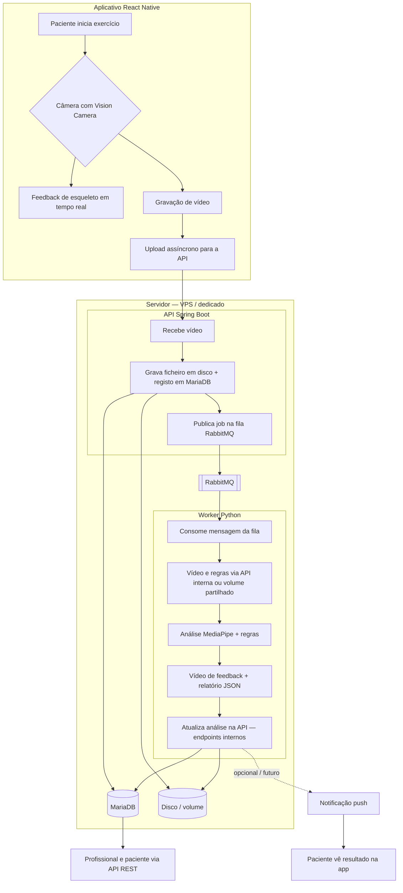
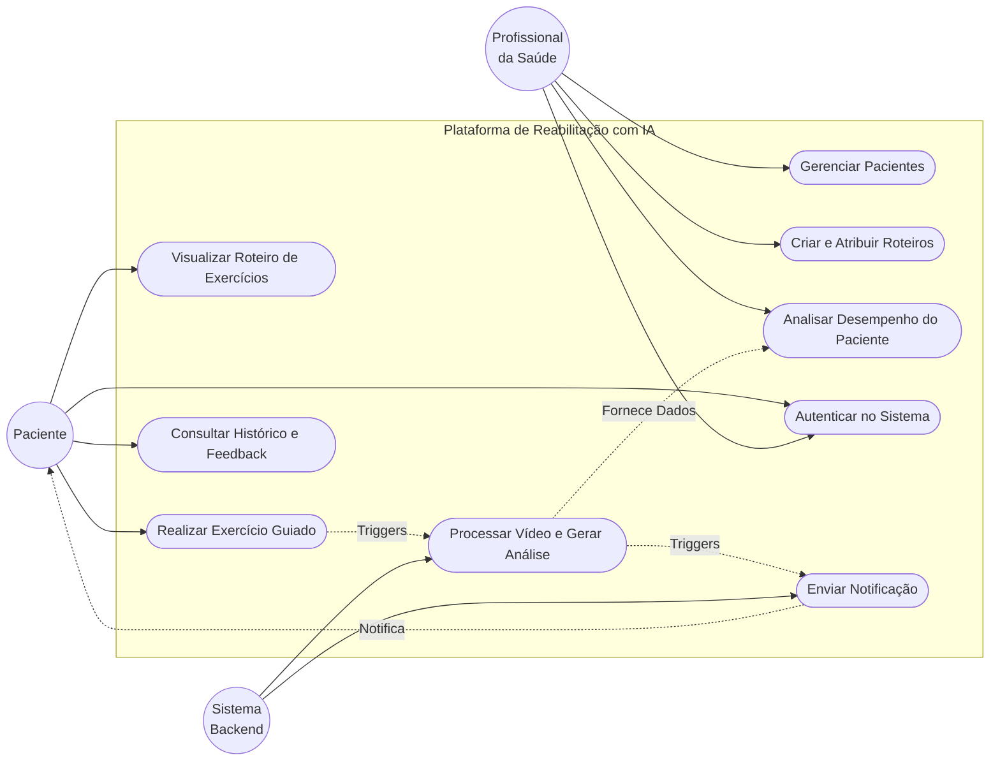
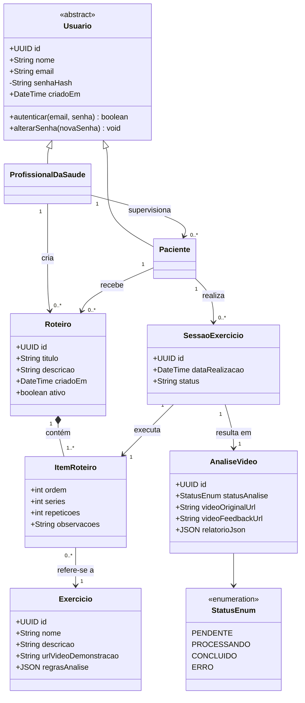
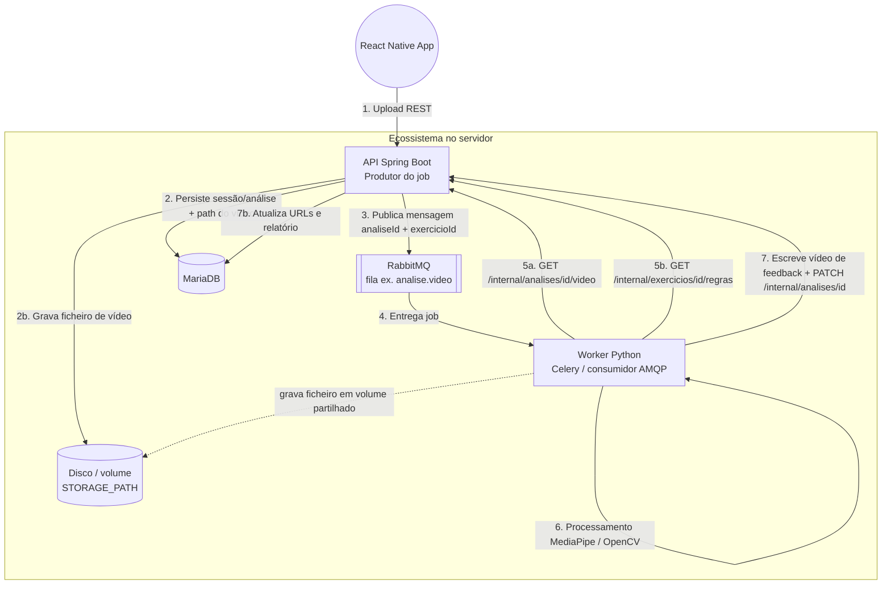

# Diagramas do Projeto Fisioterapia com IA

## 0. Decisão arquitetural: Spring Boot, MariaDB e armazenamento em disco

### O que mudou em relação à documentação anterior

Versões antigas deste arquivo e de outros materiais descreviam um backend **Python (FastAPI)** com **Supabase** como banco e armazenamento de objetos. A implementação atual da API de produção é **Spring Boot 3**, com **MariaDB** (esquema versionado por **Flyway**) e **ficheiros de vídeo no sistema de ficheiros** (configurável via `STORAGE_PATH`), não via Supabase.

O **worker de análise** continua em **Python** (Celery, MediaPipe, OpenCV, etc.), mas o desenho alvo é integrá-lo à API via **RabbitMQ** e **endpoints internos** (`/api/v1/internal/...`), em vez de ler e gravar diretamente no Supabase.

### Por quê

- **Um único ambiente operacional (VPS ou servidor dedicado):** Pretende-se hospedar **API, worker, RabbitMQ e MariaDB** (e, se necessário, reverse proxy) no mesmo sítio ou na mesma rede privada. Stacks BaaS separadas dificultam custos, latência e políticas de rede quando tudo precisa de correr junto.
- **Controlo de dados e custos:** Base relacional auto-hospedada e disco local (ou volume anexo ao servidor) evitam dependência de quotas e pricing de storage gerido para o fluxo principal de vídeos.
- **Evolução natural para object storage:** Em produção pode substituir-se ou complementar-se o disco por **S3 compatível** (ou disco de blocos na VPS) mantendo o mesmo contrato na API (URLs/paths persistidos em `analise_video`). A mudança fica concentrada na camada de storage, não no modelo de domínio.
- **Separação de responsabilidades mantida:** A API continua a ser o **produtor** do job na fila; o worker continua a ser o **consumidor** da análise pesada; apenas a **fonte de verdade** passou a ser a API + MariaDB + disco (e não o Supabase).

Documentação complementar do contrato API ↔ worker: [INTEGRACAO_API_SPRING.md](https://github.com/Sinergia-application/sinergia-app/blob/main/sinergia-worker/docs/INTEGRACAO_API_SPRING.md) (monorepo [Sinergia-application/sinergia-app](https://github.com/Sinergia-application/sinergia-app), pasta `sinergia-worker/`).

---

## 1. Diagrama de Fluxo: Arquitetura e ciclo de vida

Caminho da informação desde o aplicativo até ao servidor: API Spring Boot, MariaDB, armazenamento em disco, fila RabbitMQ e worker Python.

---

## 2. Diagrama de Casos de Uso

Interações principais dos atores (Paciente, Profissional e Sistema) com as funcionalidades da plataforma.

---

## 3. Diagrama de Classes (Banco de Dados e Entidades)

Estrutura de dados que baseia o **MariaDB** (JPA/Hibernate + migrações Flyway) na API Spring Boot. Os nomes de tabelas/colunas no servidor seguem o modelo físico; aqui o foco é o modelo conceitual.

---

## 4. Arquitetura do Worker de Análise (Produtor / Consumidor)

Como o aplicativo, a **API Spring Boot** e o **worker Python** se coordenam: fila RabbitMQ, persistência em MariaDB e ficheiros em disco (evolução possível para object storage tipo S3).

**Nota:** Se API e worker partilharem o mesmo volume (mesmo host ou NFS), o passo 7 pode usar paths acordados sem transferir o vídeo de feedback por HTTP; caso contrário, prevê-se extensão da API (ex. upload interno) ou uso de object storage comum.
