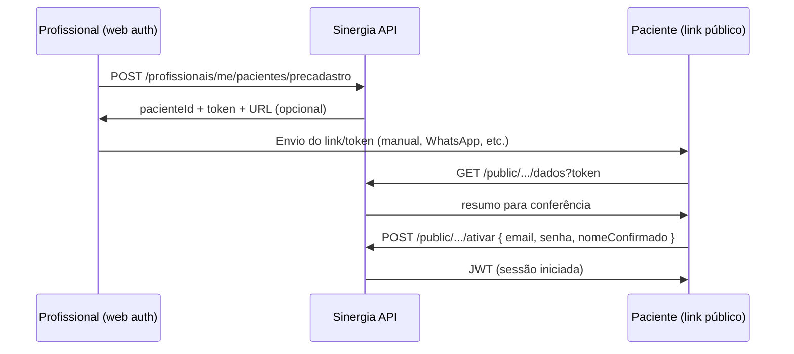

# Fluxo de onboarding do paciente — Sinergia Web / API

**Data:** abril de 2026  
**Escopo:** documentação do fluxo **adicional** de pré-cadastro pelo profissional + **primeiro acesso** pelo paciente (link/token). O cadastro público autônomo (`/auth/registro`) **permanece** disponível na API e na web; os dois fluxos podem coexistir.

---

## 1. Princípio deste fluxo (opcional)

- O **profissional** pode cadastrar dados básicos na plataforma e obter um **link/token de primeiro acesso**.
- O **paciente** abre o link, **confere** os dados, **informa e-mail** (único na plataforma) e **cria senha**; ao concluir, recebe JWT e usa o app/web normalmente.
- Contas criadas apenas por esse caminho ficam com `pendente_primeiro_acesso = true` até a ativação; **login/refresh recusam** até o paciente concluir pelo link público correspondente.

---

## 2. Front-end web (`sinergia-web`)

### 2.1 Login

- Mantém **cadastro público**: link para `/auth/registro`, botão “Continuar com Google” (placeholder até login social existir).
- Link auxiliar para **primeiro acesso** (`/auth/ativacao`) quando o paciente recebeu link do profissional.

### 2.2 Rotas relevantes

| Rota | Papel |
|------|--------|
| `/auth/login` | Login (e-mail/senha). |
| `/auth/registro` | Cadastro público do paciente (convite opcional via query/code). |
| `/auth/ativacao?token=…` | Tela de **primeiro acesso** (pré-cadastro pelo profissional): consulta por token → e-mail/senha/confirmação de nome. |
| `/profissional/pacientes/novo` | Formulário do profissional: dados iniciais; ao salvar → modal com URL/token gerados pela API. |
| `/profissional/pacientes` | Listagem com atalhos **Novo paciente**, **Código convite** e **Vincular código**. |

---

## 3. Contratos REST (Sinergia API)

Prefixo assumido: `/api/v1`.

### 3.1 Pré-cadastro (profissional autenticado)

`POST /profissionais/me/pacientes/precadastro`

**Corpo (JSON):**

| Campo | Obrigatório | Descrição |
|-------|-------------|-----------|
| `nome` | Sim | Nome completo. |
| `cpf` | Não | Apenas dígitos (11). Unicidade quando informado. |
| `dataNascimento` | Não | `YYYY-MM-DD`. |
| `telefone` | Não | Texto livre. |
| `condicao` | Não | Observação clínica / objetivo resumido. |

**Efeito:** cria usuário **paciente** com e-mail provisório interno, senha interna aleatória, `pendente_primeiro_acesso = true`, vínculo ao profissional logado, código público usual, e um **token de primeiro acesso** com validade configurável.

**Resposta (201):**

| Campo | Descrição |
|-------|-----------|
| `pacienteId` | UUID do paciente. |
| `tokenPrimeiroAcesso` | Token opaco (hex 64 chars) — tratar como segredo de curta duração. |
| `validoAte` | ISO-8601 (expiração do token). |
| `urlAtivacaoWeb` | Opcional; presente se `app.links.web-primeiro-acesso-base-url` estiver definido; inclui `?token=…`. |

**Configuração (`application.yml`):**

- `app.links.web-primeiro-acesso-base-url` — base da URL web (ex.: `https://app.exemplo.com/auth/ativacao`).
- `app.links.primeiro-acesso-validade-dias` — dias de validade do token (default 14).

### 3.2 Consultar dados do primeiro acesso (público)

`GET /public/pacientes/primeiro-acesso/dados?token={tokenHex}`

**Resposta:** `PacientePrimeiroAcessoDadosPublicResponse`: `valido`, `mensagem` (se inválido), e campos não sensíveis (`nome`, `dataNascimento`, `cpfResumido`, `condicao`, `nomeProfissional`).

### 3.3 Ativar conta (público)

`POST /public/pacientes/primeiro-acesso/ativar`

**Corpo:**

| Campo | Obrigatório | Descrição |
|-------|-------------|-----------|
| `token` | Sim | Mesmo valor entregue no link. |
| `email` | Sim | E-mail definitivo único na plataforma. |
| `senha` | Sim | Mínimo 6 caracteres (Bean Validation na API). |
| `nomeConfirmado` | Não | Ajuste do nome antes de gravar (se omitido ou vazio, mantém o informado pelo profissional). |

**Resposta:** mesmo contrato de **login** (`accessToken`, `refreshToken`, `expiresIn`, `usuario`), para o cliente armazenar sessão e redirecionar ao home do paciente.

### 3.4 Registro público (`/auth/registro`)

- `POST /auth/registro` **habilitado** por padrão: cria paciente com convite opcional (vínculo), `pendente_primeiro_acesso = false`, retorno no mesmo formato do login.
- Este fluxo é independente do pré-cadastro + primeiro acesso descrito neste documento.

### 3.5 Login com conta pendente (somente conta do fluxo pré-cadastro profissional)

- Se `pendente_primeiro_acesso = true`, **login** e **refresh** recusam com mensagem pedindo conclusão pelo link de primeiro acesso.

---

## 4. Base de dados (resumo)

Migração **`V8__paciente_primeiro_acesso.sql`** (exemplo):

- `usuario.pendente_primeiro_acesso` (boolean, default `false`).
- `paciente.cpf` (varchar, único quando preenchido).
- Tabela `paciente_primeiro_acesso_token`: `paciente_id`, `token_sha256` (único), `expira_em`, `usado_em`.

---

## 5. Fluxo textual (diagrama conceitual)

---

## 6. Alinhamento app mobile (Sinergia React Native)

- Pode usar o mesmo `POST /auth/registro` já existente ou chamar `/public/pacientes/primeiro-acesso/*` quando o onboarding for iniciado pelo profissional na web/backend.
- Deep links de convite podem direcionar para URLs web (`/auth/registro`, `/auth/ativacao`) conforme estratégia de produto.

---

## 7. Documentos relacionados

- `REGISTRO_E_VINCULO_PACIENTES.md` — convite por código, código público e vínculo; coexistem com o fluxo opcional de primeiro acesso descrito aqui.
